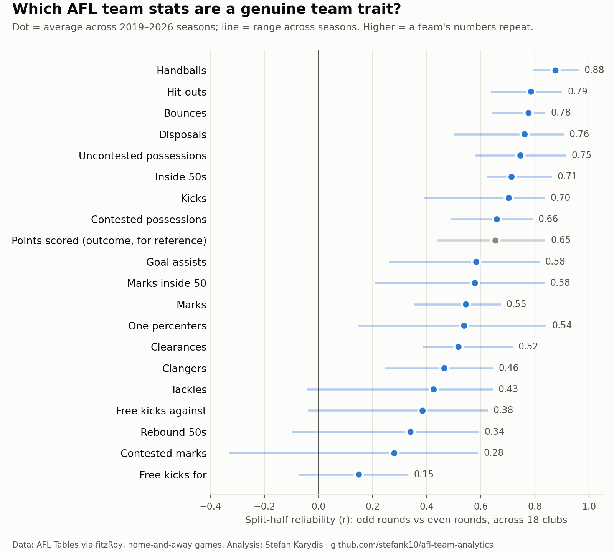
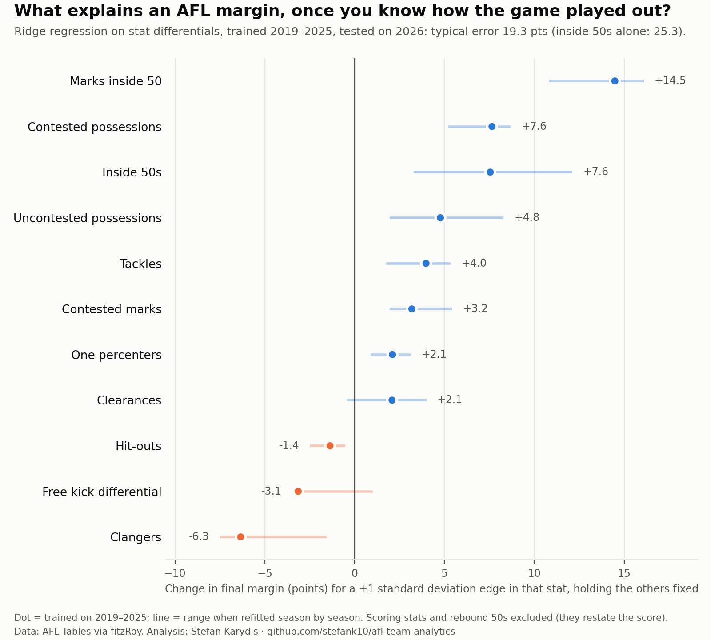

# AFL Team Analytics

**What actually drives AFL margins, and how do teams play?**
A reproducible Python analysis of public AFL data, 2019–2026.

Written by Stefan Karydis — sport scientist and football data analyst.

---

## For coaches: the short version

- **How a team moves the ball is its most repeatable trait.** Handball use and uncontested possession rank the clubs almost the same way week after week, so they're the best guide to how an opponent will play.
- **Some stats are mostly noise game to game.** Free kicks, contested marks and team tackle counts swing a lot, so I wouldn't read much into one week of them.
- **Marks inside 50 carry the most weight.** Once a game is played, each extra mark inside 50 is worth about 2 points of margin, more than any other stat edge.
- **Win the contested ball and get it inside 50.** Those are the next biggest edges. Clangers cost about half a point each.
- **These are patterns, not guarantees.** They come from public data and describe what happened in games; they don't prove that chasing one stat will change a result.

## Questions

1. **Which team statistics are signal, not noise?** Split-half reliability of team stats: which ones are stable team traits and which mostly bounce around week to week.
2. **How do teams play?** A style map of all 18 clubs using PCA, and how the competition has shifted since 2019.
3. **What explains the margin?** A regularised regression trained on 2019–2025 and tested on the 2026 season, compared against a simple baseline.

Each section ends with a summary example for coaches.

## Data

Public data from [AFL Tables](https://afltables.com), pulled with the [fitzRoy](https://github.com/jimmyday12/fitzRoy) R package.

## Project structure

```
R/pull_data.R        # raw data pull (fitzRoy, R)
src/                 # Python: cleaning, features, models
notebooks/           # analysis walkthroughs
tests/               # data integrity checks (e.g. team scores match official results)
data/raw/            # raw CSVs from fitzRoy
data/processed/      # tidy team-match table
outputs/figures/     # charts
```

## How to run

```bash
# 1. Pull the raw data (R)
Rscript R/pull_data.R

# 2. Set up Python
conda env create -f environment.yml      # or: pip install -r requirements.txt
conda activate afl-team-analytics

# 3. Build the tidy table and run the checks
python -m src.build_team_matches
pytest

# 4. Analyses
python -m src.reliability
python -m src.margin_model
```

## How I used an AI coding agent

I built this with an AI coding agent as a pair programmer. My rules:

- **I own the questions and the interpretation.** The agent drafts code; I decide what to measure and what the result means.
- **Every number is tested.** Automated tests check the data against known totals (e.g. every team's score matches the official result) before any modelling.
- **Every change is reviewed and committed.** The commit history shows how the analysis developed.

**A mistake caught in review.** The first version of the margin model included rebound-50 differential and explained 95% of the 2026 margin, with a typical error under 7 points. That was too good to be true to me. An inside 50 either ends in a scoring shot or gets rebounded by the opponent, so inside-50 differential plus rebound-50 differential largely just rebuilds the scoring-shot differential (r = 0.82 in this data). Meaning that the model was just restating the scoreboard, and not explaining it. It was decided that rebound 50s should be removed, and a test (`tests/test_margin_model.py`) now fails if any scoring-related stat is used as a feature.

## Results so far

### 1. Which team stats are signal?



**For coaches:** how a team moves the ball (handballs, uncontested possessions, disposals) is the most repeatable part of its style, so it's the best guide to how an opponent will play. Free kicks for, contested marks and tackle counts swing a lot from week to week, so one game of them tells you little.

Run: `python -m src.reliability` (table in `outputs/reliability.csv`).

### 2. What explains the margin?



A ridge regression on home-minus-away stat differentials, trained on 2019–2025 (2020 excluded: shortened quarters) and tested on the unseen 2026 season. One row per game. Scoring stats are excluded because they *are* the margin.

| Model (tested on 2026, 218 games) | Typical error (MAE, pts) | Variance explained (R²) |
| --- | --- | --- |
| Home advantage only | 31.3 | 0.00 |
| Inside-50 differential only | 25.3 | 0.38 |
| Ridge, all process stats (comparison) | 17.4 | 0.72 |
| **Ridge, interpretable set (main model)** | **19.3** | **0.65** |

**Why I didn't use the most accurate model.** I could cut the model's typical error by about 2 points by adding kicks, handballs and marks. The trouble is those stats largely count the same thing as possessions (kicks plus handballs is roughly every possession, and most marks are uncontested possessions). When a model is given the same information twice, it splits the credit between the two in strange ways. In this case it said kicks were hugely valuable and uncontested possessions were hugely costly, which makes no football sense. A coach would rightly stop trusting the model at that point. So the main model is the slightly less accurate one whose numbers all make sense, and the more accurate version is shown alongside it for comparison.

**For coaches:** once a game is played, the biggest single edge is marks inside 50, worth about 2 points of margin each. Winning the contested ball (about half a point per extra contested possession) and getting it inside 50 (about half a point per extra entry) come next. Each extra clanger costs about half a point. These are associations, not proof that chasing one number will change a result.

This model is **descriptive**: it explains a margin once you know how the game played out. It is not a pre-game prediction.

Run: `python -m src.margin_model` (scores, coefficients and 2026 predictions in `outputs/`).

## Status

- [x] Repository and data pipeline set up
- [x] Tidy team-match table + integrity tests (8 checks against official results)
- [x] Stat reliability
- [ ] Team style map
- [x] Margin model (time-based split, two baselines, leakage test)
- [x] Coach summary
